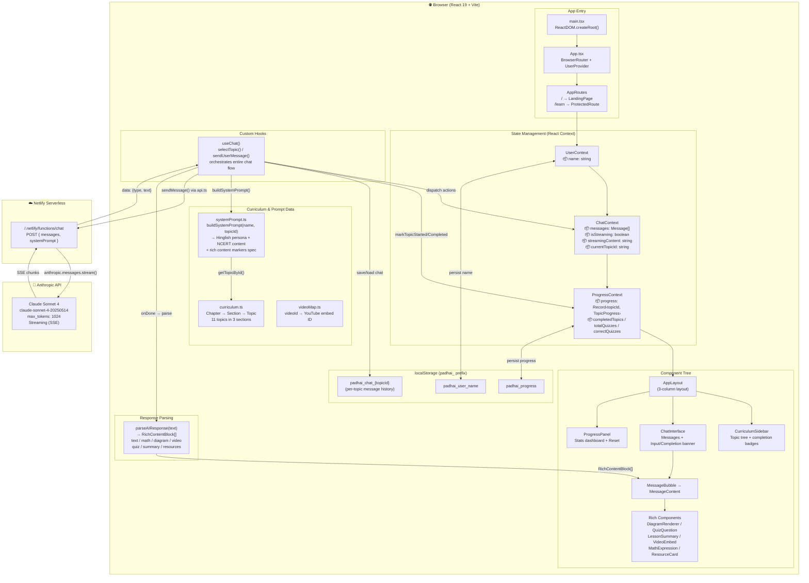
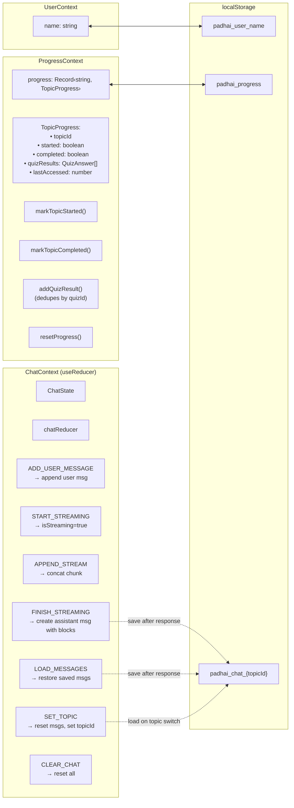
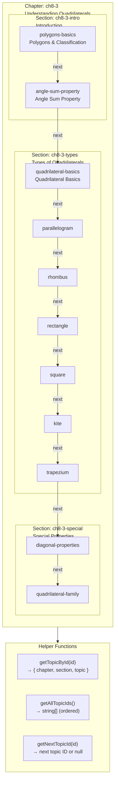
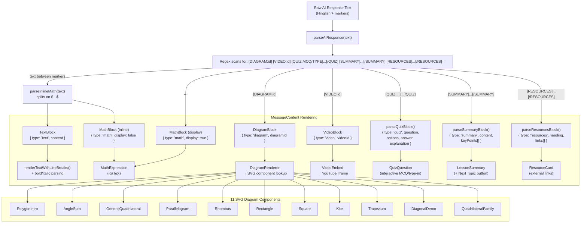
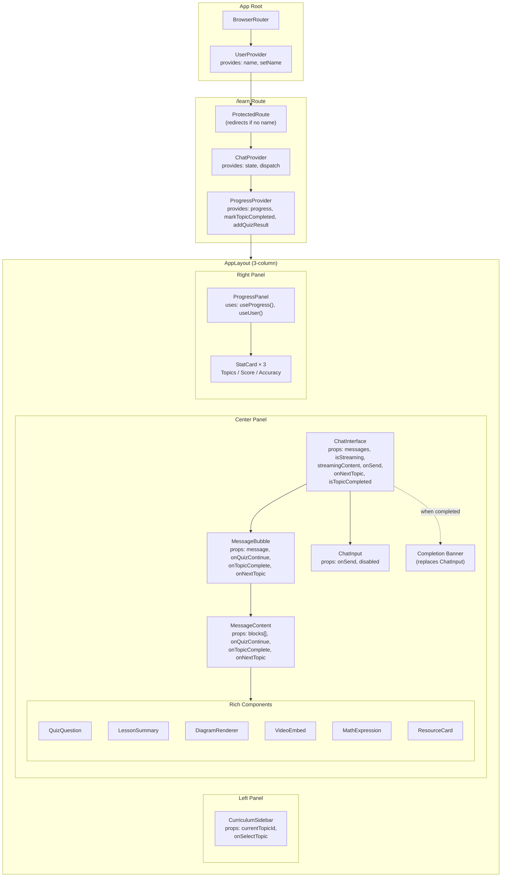
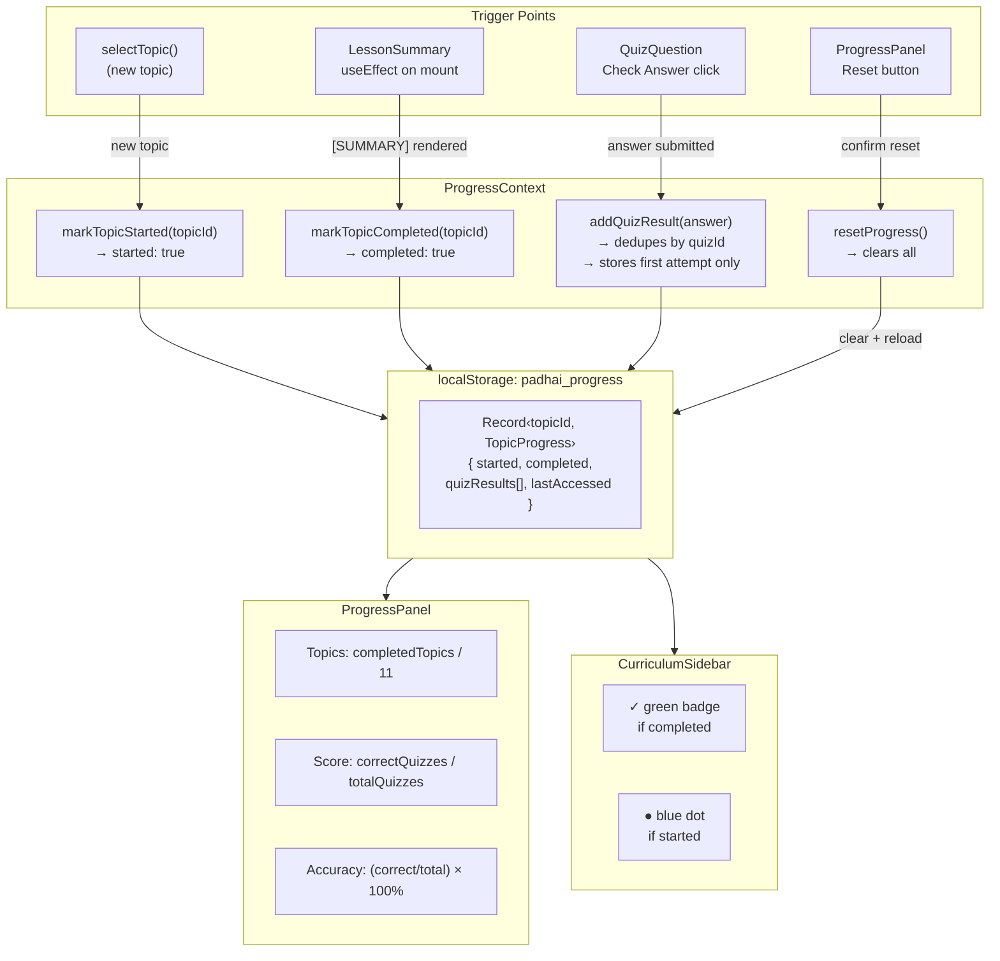
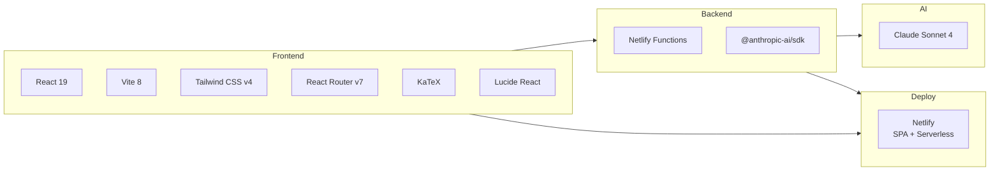

# PadhAI — Architecture & Flow Diagram

## High-Level System Architecture



## State Management Detail



## Curriculum Data Structure



## AI Chat Flow (Complete Message Lifecycle)

```mermaid
sequenceDiagram
    participant U as User
    participant CI as ChatInterface
    participant UC as useChat()
    participant CC as ChatContext
    participant API as api.ts
    participant NF as Netlify Function
    participant CL as Claude Sonnet 4
    participant PAR as parseAIResponse
    participant PC as ProgressContext
    participant LS as localStorage

    Note over U,LS: === Topic Selection ===
    U->>CI: Clicks topic in sidebar
    CI->>UC: selectTopic(topicId)
    UC->>LS: Save current chat (padhai_chat_{oldTopic})
    UC->>LS: Check for saved chat (padhai_chat_{newTopic})

    alt Saved chat exists
        UC->>PAR: Re-parse blocks for assistant msgs
        UC->>CC: dispatch LOAD_MESSAGES
    else New topic
        UC->>CC: dispatch SET_TOPIC
        UC->>PC: markTopicStarted(topicId)
    end

    Note over UC,CL: === Initial AI Greeting ===
    UC->>UC: buildSystemPrompt(name, topicId)
    UC->>CC: dispatch START_STREAMING
    UC->>API: sendMessage({ systemPrompt, messages: [synthetic intro] })
    API->>NF: POST /.netlify/functions/chat
    NF->>CL: anthropic.messages.stream()

    loop SSE Streaming
        CL-->>NF: text delta
        NF-->>API: data: {"type":"content","text":"..."}
        API-->>UC: onChunk(text)
        UC->>CC: dispatch APPEND_STREAM
        CC-->>CI: streamingContent → StreamingText component
    end

    NF-->>API: data: [DONE]
    API-->>UC: onDone(fullText)
    UC->>PAR: parseAIResponse(fullText)
    PAR-->>UC: RichContentBlock[]
    UC->>CC: dispatch FINISH_STREAMING { blocks }
    CC-->>CI: New message with blocks rendered

    Note over U,LS: === User Sends Message ===
    U->>CI: Types message + Enter
    CI->>UC: sendUserMessage(content)
    UC->>CC: dispatch ADD_USER_MESSAGE
    UC->>API: sendMessage({ systemPrompt, messages: [...history, newMsg] })

    Note over API,CL: Same streaming flow as above

    UC->>CC: dispatch FINISH_STREAMING
    UC->>LS: Save full history (padhai_chat_{topicId})

    Note over U,LS: === Quiz Answer ===
    U->>CI: Selects answer in QuizQuestion
    CI->>PC: addQuizResult({ quizId, isCorrect, ... })
    PC->>LS: persist to padhai_progress
    CI->>UC: sendUserMessage("I answered X...")
    Note over UC,CL: Triggers AI response about the answer

    Note over U,LS: === Topic Completion ===
    Note over CI: AI sends [SUMMARY] block
    CI->>CI: LessonSummary renders with useEffect
    CI->>PC: markTopicCompleted(topicId)
    PC->>LS: persist to padhai_progress
    CI->>CI: ChatInput replaced with completion banner
    CI->>CI: "Next Topic" button appears
    U->>CI: Clicks "Next Topic"
    CI->>UC: selectTopic(nextTopicId)
    Note over UC: Fresh chat thread starts
```

## Rich Content Parsing Pipeline



## Component Hierarchy & Prop Flow



## Progress Tracking Flow



## System Prompt Construction

```mermaid
flowchart LR
    subgraph Inputs
        Name["studentName"]
        TID["topicId"]
    end

    subgraph Lookup
        GTB["getTopicById(topicId)<br/>→ topicTitle"]
        TGH["topicGreetingHints[topicId]<br/>→ topic-specific hook"]
    end

    subgraph PromptSections["buildSystemPrompt() Output"]
        P1["1. Persona<br/>PadhAI — warm AI math tutor"]
        P2["2. Language Rules<br/>MUST use Hinglish always"]
        P3["3. Personality<br/>Short msgs, emojis, celebrate"]
        P4["4. Critical Rules<br/>Only relevant diagrams,<br/>unique greetings, auto-advance"]
        P5["5. Teaching Flow<br/>Hook → Explain → Quiz →<br/>Feedback → Summary → Video"]
        P6["6. Rich Content Markers<br/>[DIAGRAM:id] [VIDEO:id]<br/>[QUIZ:MCQ/TYPE] [SUMMARY]<br/>[RESOURCES] $math$"]
        P7["7. NCERT Chapter 3<br/>Full reference material<br/>(all properties & formulas)"]
        P8["8. Current Topic<br/>title + greeting hint"]
    end

    Inputs --> Lookup --> PromptSections
```



## Tech Stack


